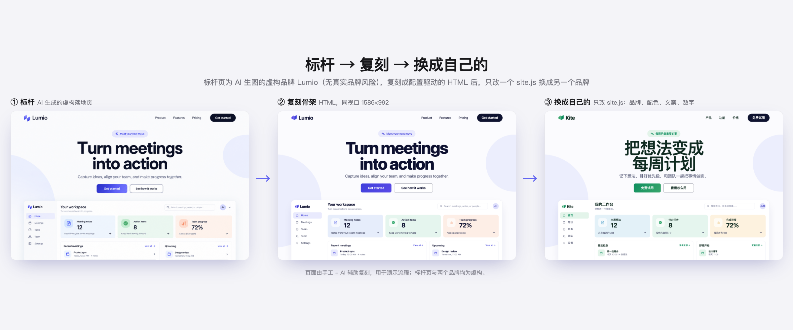
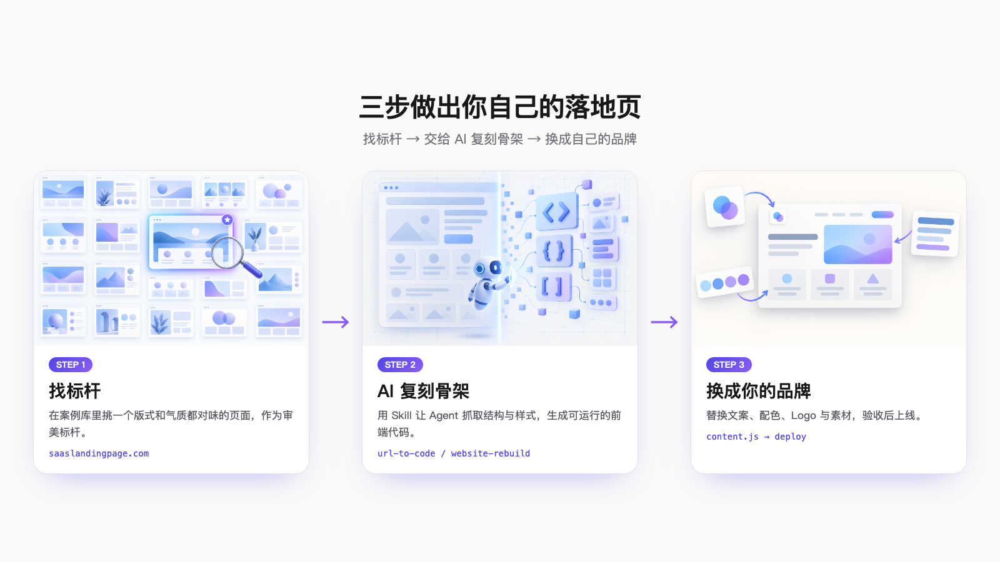

# landing-page-workflow

做落地页的一套工作流：**找标杆 → 用 AI Agent 复刻骨架 → 换成自己的内容**。

仓库里有一个可以直接改的起始模板、一个完整的演示，以及每一步给 AI 的提示词。



## 工作流

1. **找标杆。** 在 [saaslandingpage.com](https://saaslandingpage.com) 之类的案例库里挑一两个版式和气质合适的页面，记下为什么选它。
2. **复刻骨架。** 用支持 Skill 的 Agent（例如 Codex 的 `url-to-code`，或更重的 [website-rebuild-skill](https://github.com/boyang-hu/website-rebuild-skill)）理解并还原页面结构。
3. **换成自己的。** 文案、配色、Logo、图片、数据全部换成你自己的，检查后上线。



## 目录

| 路径 | 内容 |
| --- | --- |
| `starter/` | 原创的落地页起始模板，只改 `content.js` 就能换品牌；`examples/coffee.js` 是换品牌的示例 |
| `demo/` | 演示：`benchmark.png` 是 AI 生成的虚构落地页（Lumio），`index.html` 是照它复刻的页面，`site.kite.js` 是换成另一个虚构品牌的配置 |
| `prompts/` | 每一步给 AI 的提示词模板，以及上线前检查清单 |

## 使用

不需要构建，直接用浏览器打开：

```bash
git clone https://github.com/Sneakeref/landing-page-workflow.git
cd landing-page-workflow/starter
open index.html
```

改 `content.js` 换成你的品牌。想看换品牌的效果，把 `examples/coffee.js` 的内容覆盖到 `content.js` 即可。

演示同理：`demo/site.kite.js` 覆盖到 `demo/site.js`，刷新页面。

## 说明

- `demo/` 里的复刻页是手工加 AI 辅助完成的，与标杆图在同一视口下的平均像素差约 4%，不是逐像素一致。它用来说明流程，不代表任何复刻 Skill 的实测效果。
- 标杆页和两个品牌（Lumio、Kite）都是虚构的。

## 关于版权与合规

复刻他人网站只用来学习页面结构。不要把对方的文案、图片、Logo、品牌名、客户名单和数据带进你的成品，也不要把复刻品原样公开或上线。所提到的 Skill 本身都要求只用于你自己拥有、或有权重建的网站。

本仓库不包含任何第三方网站的复刻代码或素材。

## 许可

[MIT](LICENSE)。配图由 Codex 生图模型生成。
